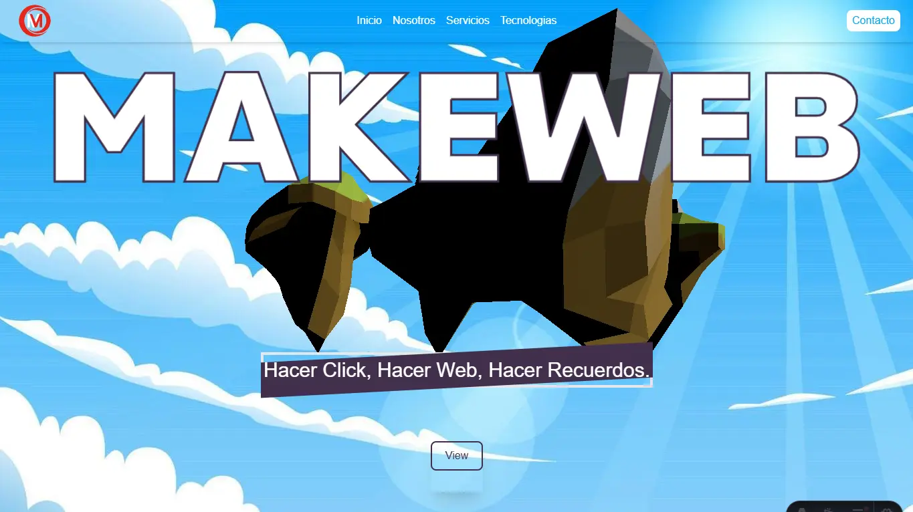

    <h1 style="font-size: 3em; font-weight: bold; margin: 20px 0;">MakeWeb</h1>

Main page of MakeWeb developed with Astro 5, TailWind, and Three.js

](https://raw.githubusercontent.com/MakeWebMX/MakeWebPrincipal/refs/heads/main/public/MakeWeb%20Logo_MW.svg)

<h2> Technologies</h2>

**[Astro 5](https://astro.build)** is a modern static site generator that allows you to build fast and optimized websites.  
**[Three.js](https://threejs.org)** is a JavaScript library that enables the creation of 3D graphics in the browser using WebGL.  
**[TailWind](https://tailwindcss.com)** is a utility-first CSS framework, providing a highly customizable and efficient way to style your web applications.

<h2>License</h2>

Copyright (c) 2024  Designed & Developed [MakeWeb](https://github.com/MakeWebMX)

Please contact [Mario](https://www.linkedin.com/in/it-mario-hernández/) if you would like to reuse any part of this site for personal or commercial use.

<h2>Contact Me</h2>

<h2>Comments</h2>

There are comments in Spanish; you can send a message for more information.

<h2>License</h2>

This project is licensed under the terms of the MIT License. See the [MIT License](LICENSE)
